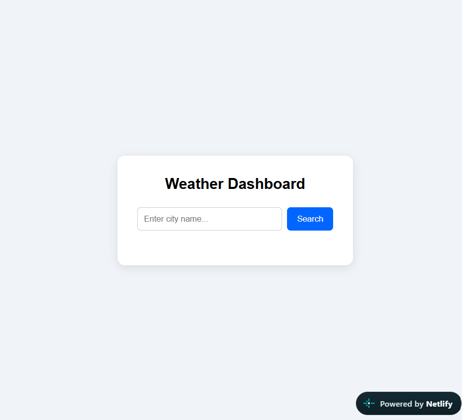

# 🌤️ Weather Dashboard

A sleek, responsive Weather Dashboard built with vanilla web technologies. This application allows users to search for real-time weather information for any city using the OpenWeatherMap API.

 

## 🚀 Features

* **Real-time Data:** Fetches live temperature, weather conditions, humidity, and wind speed.
* **Search Functionality:** Instant city lookup with error handling for invalid locations.
* **Responsive Design:** Optimized for desktop, tablet, and mobile viewing.
* **Asynchronous API Handling:** Built using modern JavaScript `async/await` and the Fetch API.

## 🛠️ Tech Stack

* **Frontend:** HTML5, CSS3, JavaScript (ES6+)
* **API:** [OpenWeatherMap API](https://openweathermap.org/api)
* **Hosting:** Netlify
* **Version Control:** Git & GitHub

## 💻 Local Setup

To run this project locally on your machine:

1. Clone the repository:
   ```bash
   git clone [https://liarogk.github.io/weather-dashboard/](https://liarogk.github.io/weather-dashboard/)